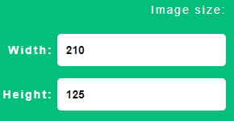
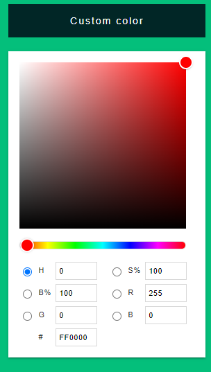
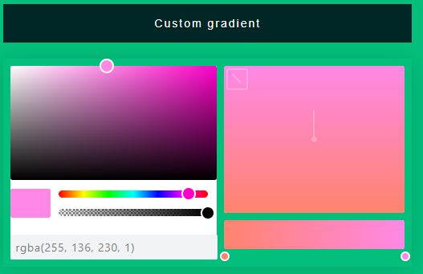
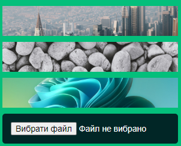

# TextToImageConverter

Цей сервіс призначений, щоб перетворити ТЕКСТ на КАРТИНКУ в форматі .PNG

- В текстовому редакторі ви маєте можливість ввести текст, який автоматично буде дублюватись в області збереження майбутнього зображення.
- Ви маєте можливість змінити висоту і шируно майбутнього зображення, ввести певне значення в PX в відповідні поля (Width, Height) 

- Також ви можете змінити фон зображення на будь-який колір, вкиористовуючи вже запропоновані кольори, або вибравши довільний колір за допомогою розширення 

- Є можливість застосувати градієн на фон малюнку. Можна використати підготовлені градієнти або створити свій 

- На фон, користувач має можливість також встановити зображення. Вибрати з запропанованих або завантажити своє 

- Користувачу доступна можливість створити свій шаблон, який можна буде використовувати постійно, не воддивши завжди одні й ті самі значення (ширину, висоту, колір, текст, фон). Ця функція доступна за додаткову оплату, звернувшись до розробника сервісу на пошту esongrovaa@gmail.com 

