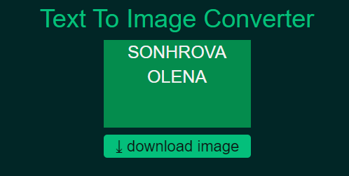
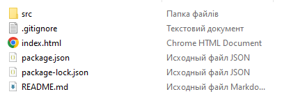
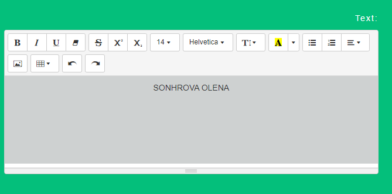
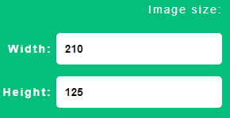
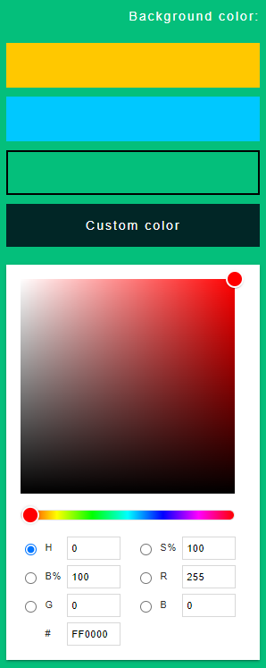
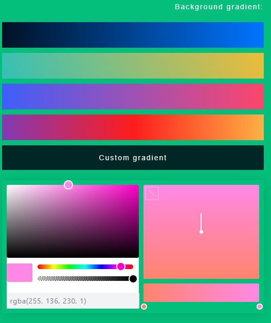
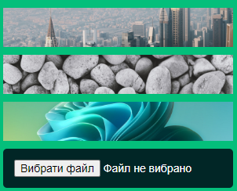

# TextToImageConverter

This service is designed to convert TEXT to PICTURE in .PNG format
https://olenasonhrova.github.io/TextToImageConverter/

To start the project on a local computer, download the file archive and open the index.html file in a browser
 

- In the text editor, you have the opportunity to enter text that will automatically be duplicated in the area where the future image is saved

- You have the opportunity to change the height and width of the future image, enter a certain value in PX in the corresponding fields (Width, Height)

- You can also change the background of the image to any color, using the already proposed colors, or choosing an arbitrary color using the extension

- It is possible to apply a gradient on the background of the picture. You can use prepared gradients or create your own

- On the background, the user can also set an image. Choose from the suggested ones or download your own

- The user has the opportunity to create his own template, which can be used constantly, without always entering the same values (width, height, color, text, background). This feature is available for an additional fee by contacting the service developer at esongrovaa@gmail.com

